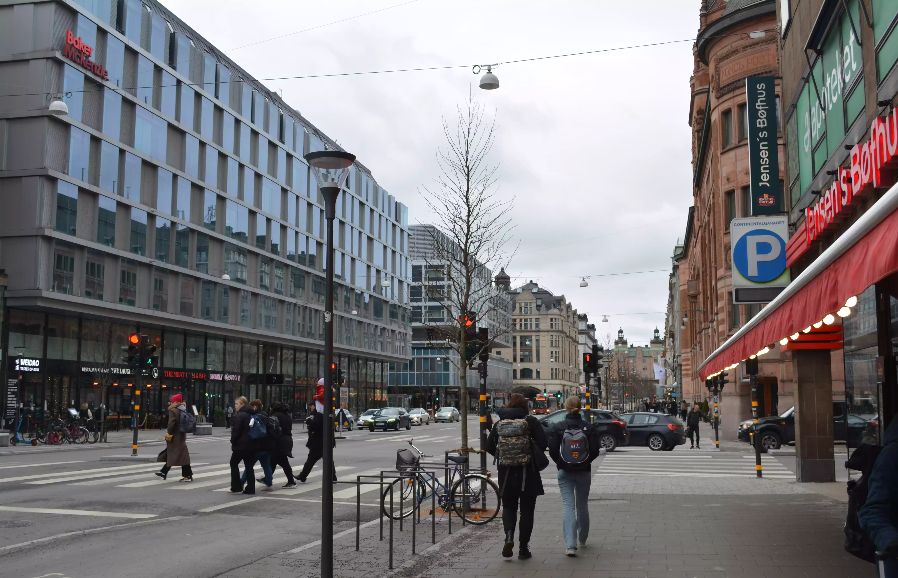
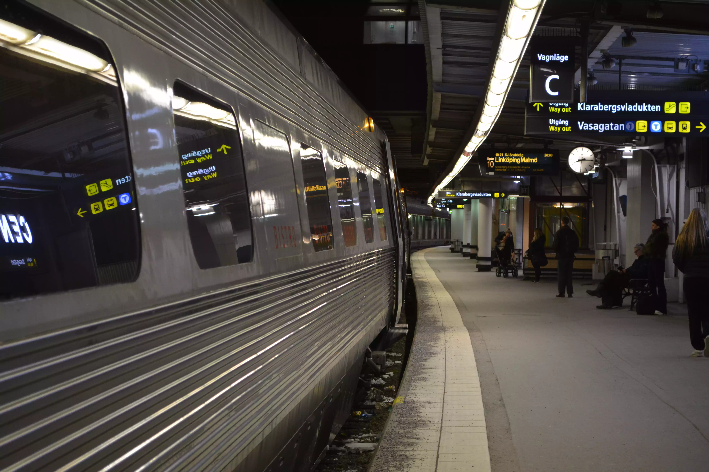

## Going to the Sweden

Our journey started as a usual trip. We got our bags and went to the airport. Ali, Miguel and Sinan were travelling
together, they landed at Bromma airport in Stockholm.

We had some time to kill at Stockholm until we had to catch our train so we went to the city center. 
We ate some really nice food and walked around the city.

## At the train station

Noticing the time, we went to the Stockholm Central Station to catch our train to Skövde.
Sadly, we noticed that there were a lot of delays and our train also got delayed by about an hour.

