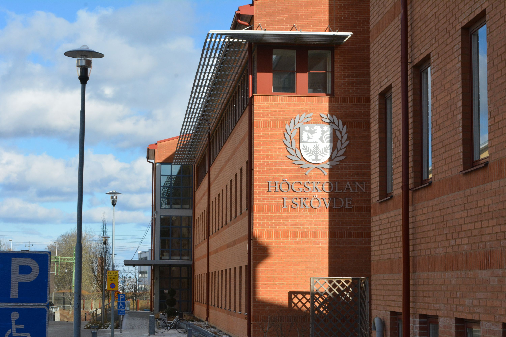

On day one, we woke up at 8 in the morning, had breakfast for too long and rushed to the university. Despite it being spring season, it was a very cold and snowy day with the temperature reaching -8 Celcius in the morning. 

## The start of our project
At the university, we were given the introduction and later on we formed the teams. Each team were given four vulnerable systems with the goal of defending your own whilst attacking the others. We were excited to chat with our new friends from Sweden and discuss our strategies.

After the project briefing, our coaches gave us a tour of the city and recommended some great places to eat at. We spent the rest of the day exploring the city on our own, planning activities for the upcoming days.

Ultimately, we had a great first day in the city and were excited for the next day, which promised even more snowfall.