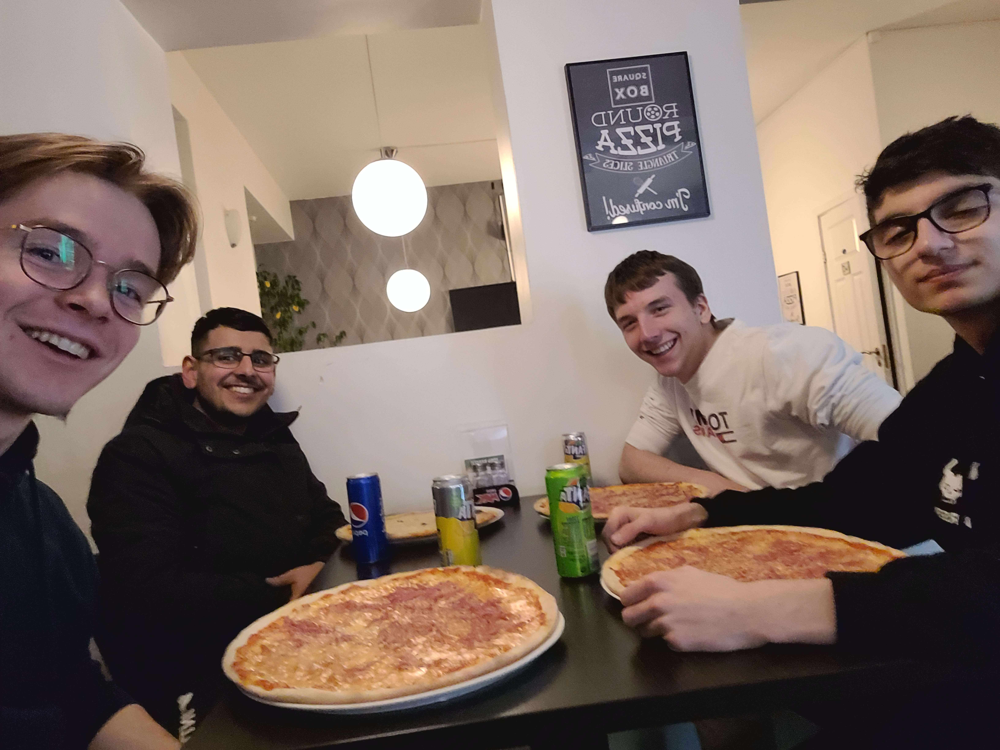

## Continuation: Strengthening System Security and Documentation

On the second day, we picked up where we left off the previous day, focusing on the continuous check-up and improvement of our system's security measures. Our main goal was to strengthen our defences against possible attacks. We examined our system, identifying areas that required changes and implementing the necessary updates. In addition, we made sure to carefully make notes of the modifications, as we were expecting a system reset in the near future, which would require us to reconfigure everything from scratch. 

## Assisting Erik with a Car Breakdown

Following our project work, we encountered a gentleman from Sweden named Erik, who was experiencing car troubles. Several members of our team promptly offered their assistance, working together to get his vehicle back on the road. After some concerted effort, we successfully jump-started his car, allowing him to continue his journey. Grateful for our help, Erik kindly invited us to share a meal together. We happily accepted his invitation and enjoyed a delightful dinner in his company.

## Socializing with Nico over Drinks

Later in the evening, a group of students proposed Nico to join them for a night out and enjoy some drinks. While a few of us were feeling exhausted or occupied with pending tasks that needed completion, Nico decided to join the others for a relaxing social gathering. It was a chance for them to unwind and enjoy each other without school/work interfering.
