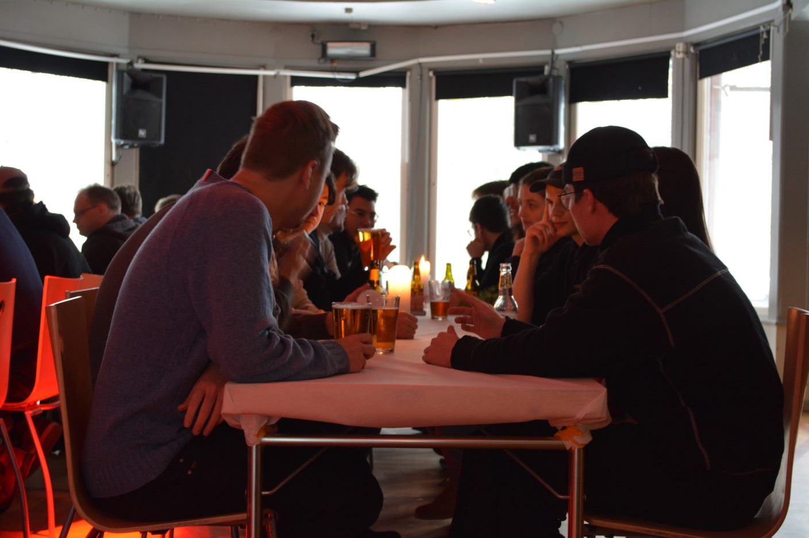

## Wednesday Morning
Wednesday was an exceptionally diverse day filled with challenges and excitement. Our task was to start from scratch and set up the security, aiming to make everything operational as quickly as possible, so that other groups wouldn't have a chance to attack us. The pressure was high, but our team was determined and got to work.

## Securing the servers and websites
Throughout the morning, the different groups diligently worked on securing the servers and websites against potential breaches. It was a race against the clock, with each team leveraging their expertise and creativity to implement the best possible security measures. Strategies were devised, security protocols were established, and firewalls were installed, all with the goal of making our digital infrastructure impenetrable.
As time passed and the clock struck 1:00 PM, the moment came when we got the green light to attack the other teams. At first, everything seemed to proceed calmly. The teams tried to decipher each other's defense and uncover weaknesses while remaining vigilant for any counter-reactions.

## The first attack
However, soon enough, some groups started discovering the vulnerabilities in most teams. It became a challenging battle where each team had to improvise and act quickly to protect their systems from potential attacks. Despite the challenges and pressure we faced, some teams managed to hold their ground and reinforce their security.

## Evening Dinner
After a day full of challenges, we gathered in the student pub in the evening to have dinner with both the Swedes and the Belgians. During the meal, we had a fun competition between the two tables, where we had to empty as many glasses as possible and line them up on the other side of the table. It turned into a hilarious and competitive evening, with the team that reached the other side of the table first winning the contest. It was a great opportunity to relax, enjoy each other's company, and strengthen our team spirit.

## Night Out
After dinner, some Belgians and Swedes decided to continue to a pub in town. We spent the evening there, full of fun and laughter. We mingled with the locals and got to know new Swedish students. It was a cozy and lively atmosphere, where we created even more beautiful memories and strengthened our international bonds. It was a fantastic opportunity to enjoy each other's company and experience the culture of the host country.
