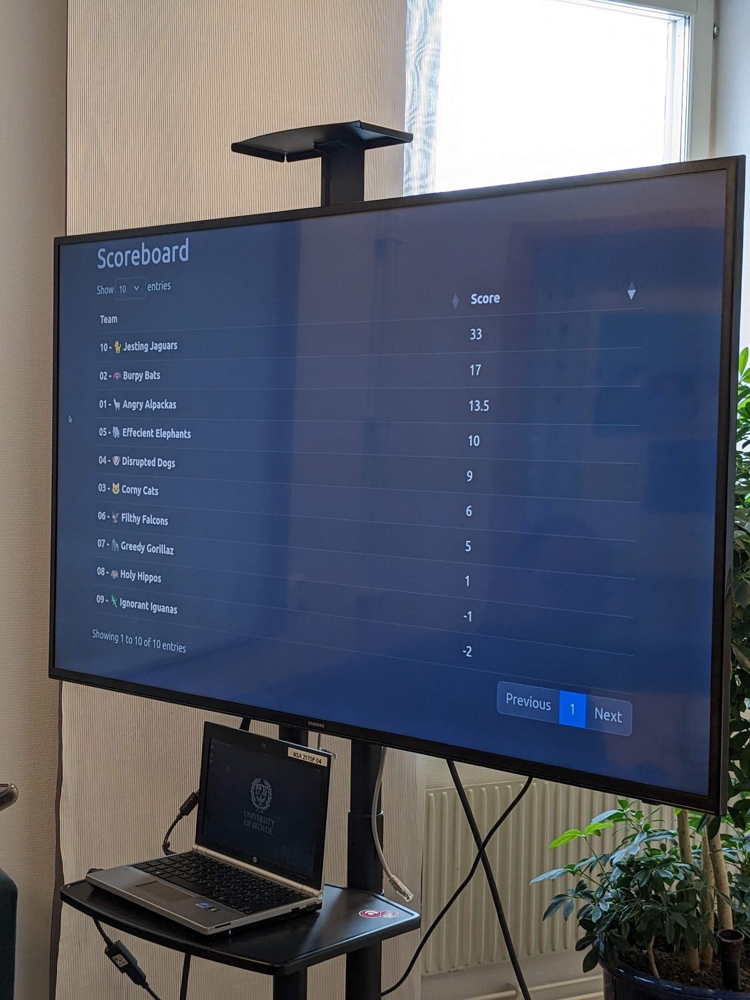
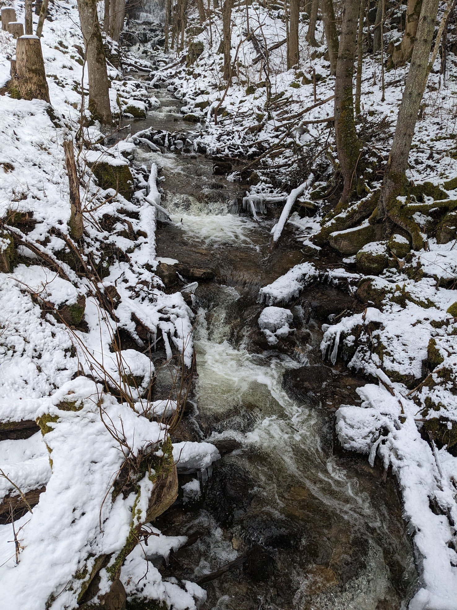
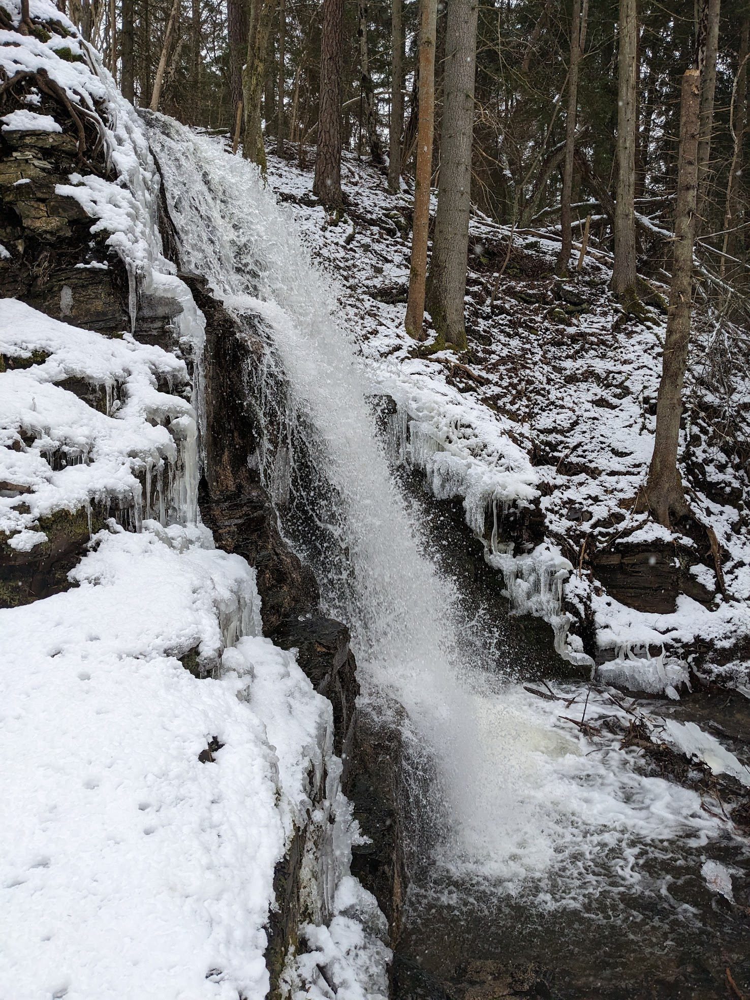
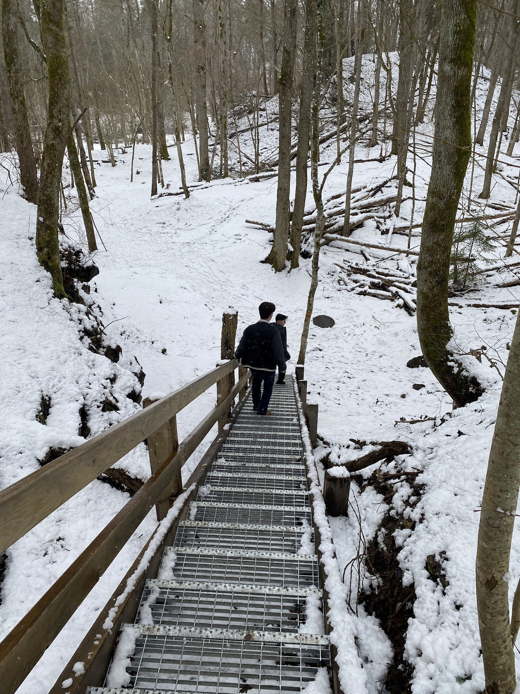
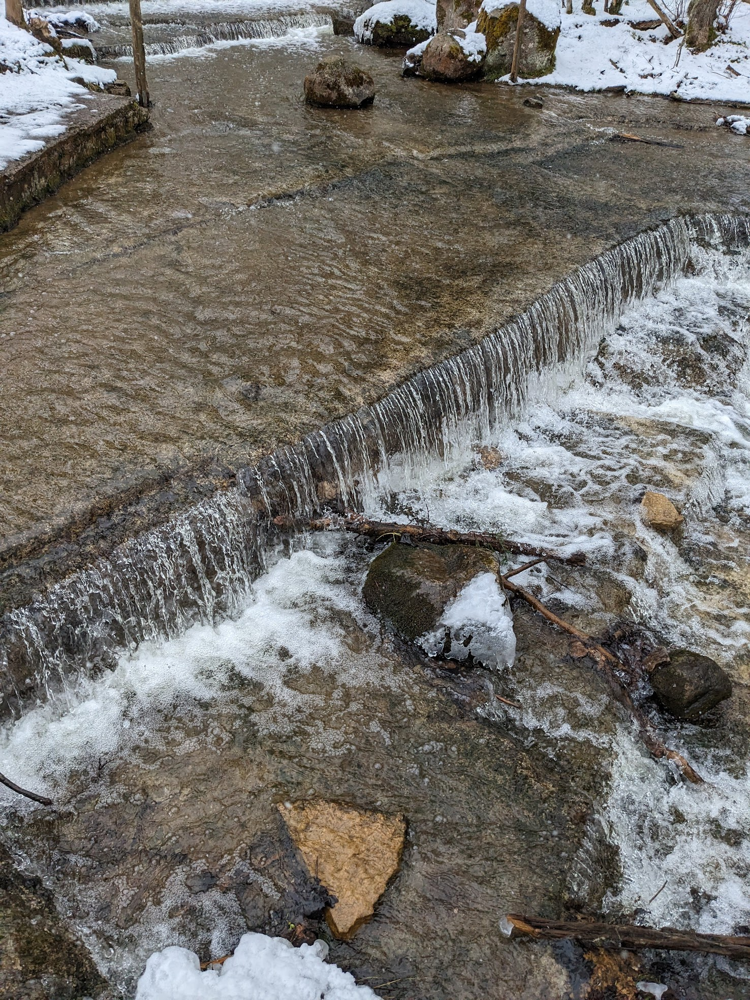
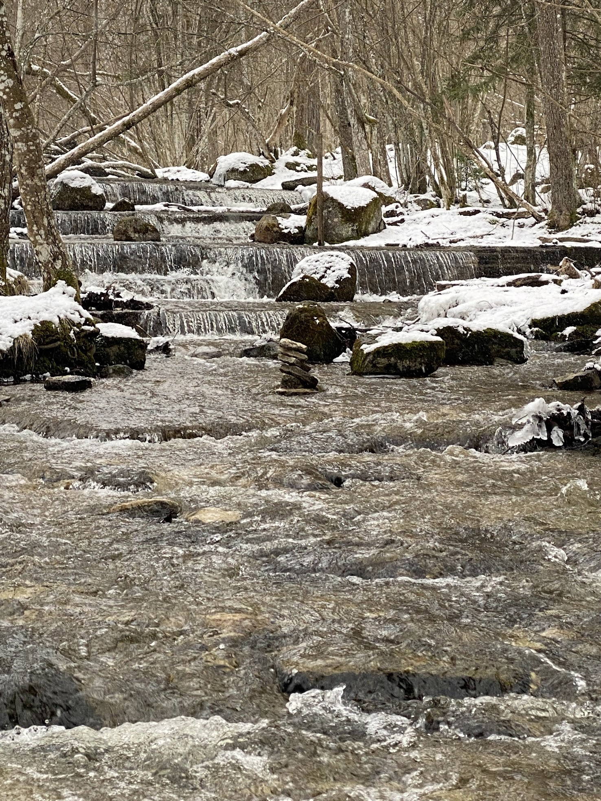
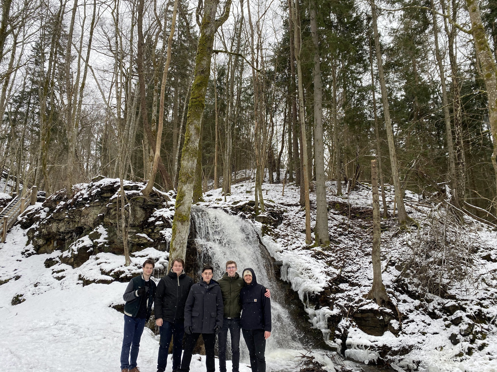

## Finishing what we started

Thursday started off slow. We made our way back to the university and continued the pentesting we started the day
before. Double-checking some exploits, testing for more vulnerabilities and so forth.

Looking at the scoreboard it was clear that things were slowing down since wednesday evening. Suddenly however, team 10
gained a ton of points and that gave us the motivation to keep looking as well.

Ali and Noa along with their team, the _Angry Alpaca's_ (Team 01) focused on defences mostly, since they hadn't been
hacked yet. Turns out that there was a way to fully block all local traffic and route everything through a cloud
firewall. This meant added protection and mitigated a lot of the attacks that were being thrown at us since most of them
at this point were DoS attacks since the other attacks were patched.

Take a look at the final scoreboard below:

After it was clear that no more attacks would be taking place anymore, the teachers called it a day, and we got some free
time to explore the city. We split up into smaller groups. Ali and Noa joined Arman, Matthis and Raf to go to a nearby
waterfall.

## Hidden beauty

Matthis and his travel companions came to Skövde by car, which was perfect since the waterfall we wanted to visit was about
20 minutes away from where we were staying. We drove to Silverfallet, a beautiful waterfall in the middle of the forest.

It had just snowed a lot the night before, so it was mesmerising to see together with frozen parts of the waterfall. We
took some pictures and enjoyed the view for a while.

There were also quite a few smaller waterfalls higher up, leading into the big one. We took a little hike up the
mountain to see them up close.

And of course, what would a trip be without a group picture?

That was it for the day. We went back to the hostel, hanged out with the rest of the students and packed our bags for
the trip back home the next day.
