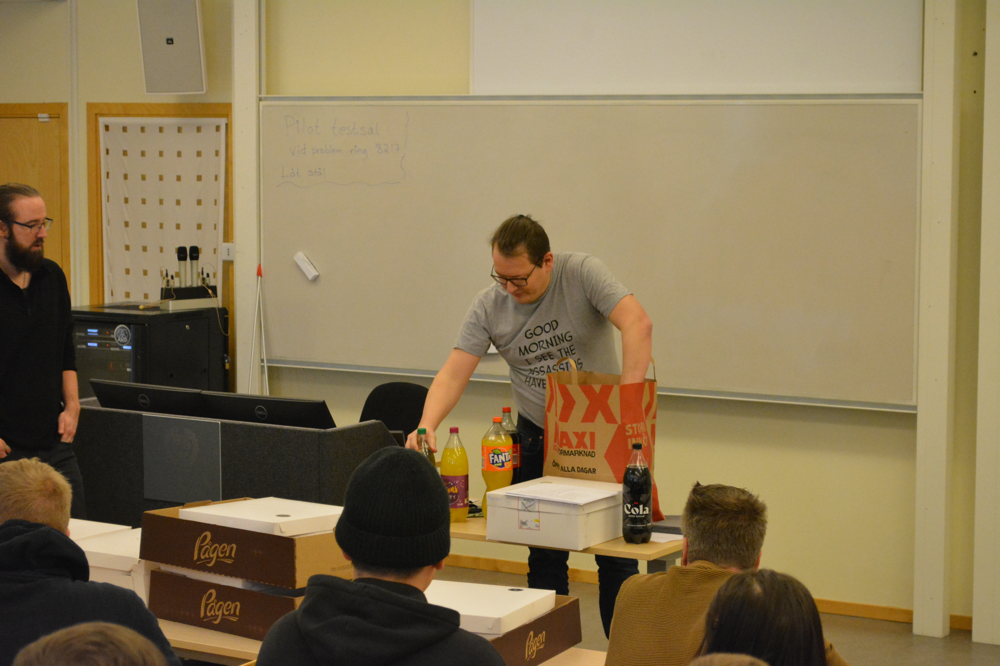
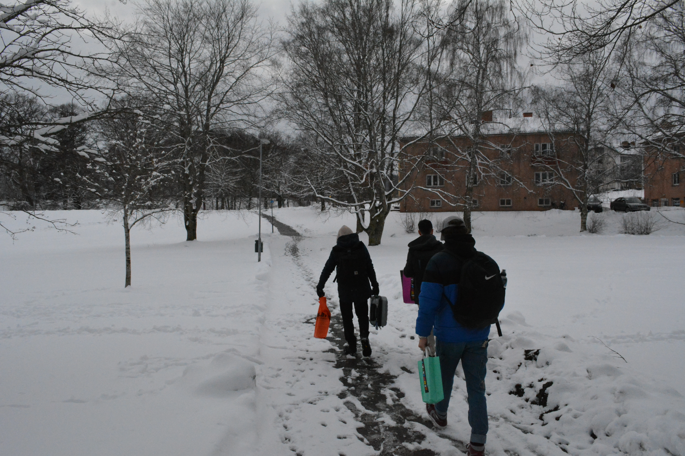

# Bidding Adieu to Skövde's School Adventure

## A Snowy Spring Morning

And so, we arrived at the grand finale of our school project week in Skövde, Sweden. It was a typical Swedish spring morning - chilly and actually, quite snowy. The sun was hiding, letting the snowflakes take center stage, creating a grey but mesmerizing morning scene.

## The Last Day of the Project

With our luggage in tow, we made our way to the school for the last time. There was no new work planned for the day; instead, we were to review everything we had accomplished throughout the week. We were eager to see who had managed to "hack" who, and who had done a stellar job at defending against the attacks.

## The Blue Hat Triumph

Much to everyone's surprise, the group that came in third on the leaderboard was declared the most secure group. With their blue hats bobbing in triumph, Noa and Ali had managed to lock down their system so tightly that they received the fewest attacks and discovered the least number of vulnerabilities. Noa gave a charismatic explanation of their methods and motives, earning the admiration and applause of everyone present.

## Final Presentation Session

Then came the part we had all been eagerly waiting for - the final presentation session with our teachers. It was a great opportunity to learn from each other as we reviewed the different approaches taken to overcome the challenges.

|                  Final Presentation                   |               Noah speech               |
| :---------------------------------------------------: | :-------------------------------------: |
|  |  |

## A Note of Acknowledgement: 'Admin Admin'

After the presentations, it was revealed that the 'Admin Admin' team had scored the highest, earning a commendable 33 points. As a token of appreciation for their efforts, each member was awarded a Skövde sweater.

## A Culinary Finale: The Smorgastarta

Following the presentations, we feasted on Smorgastarta, a delicious, traditional Swedish dish. Stacked with layers of bread, cheese, vegetables, and meats, it was a fun way to bond with our fellow participants over a shared cultural experience.

|                  Final Presentation                   |               Noah speech               |                         Smorgastarta                          |
| :---------------------------------------------------: | :-------------------------------------: | :-----------------------------------------------------------: |
|  |  |  |

## The Journey Home

With the project officially over, we all split up into different groups. Some headed to Stockholm, others to Gothenburg. Some of us even decided to stay an extra day in Stockholm, probably lured by the city's irresistible charm.

## The Snowball Battle

After leaving school, Sinan, Ali, Miguel, and Gael embarked on an adventure together. They stumbled upon a vacant lot covered in snow, and what started as innocent fun turned into a full-blown snowball fight.

## Farewell, Skövde

Sadly, the time to say goodbye had come. But as we parted ways, we couldn't help but look back at the week with fondness. This project and our time in Sweden were more than just an academic excursion; it was a journey filled with laughter, learning, and memories that we will cherish forever.
